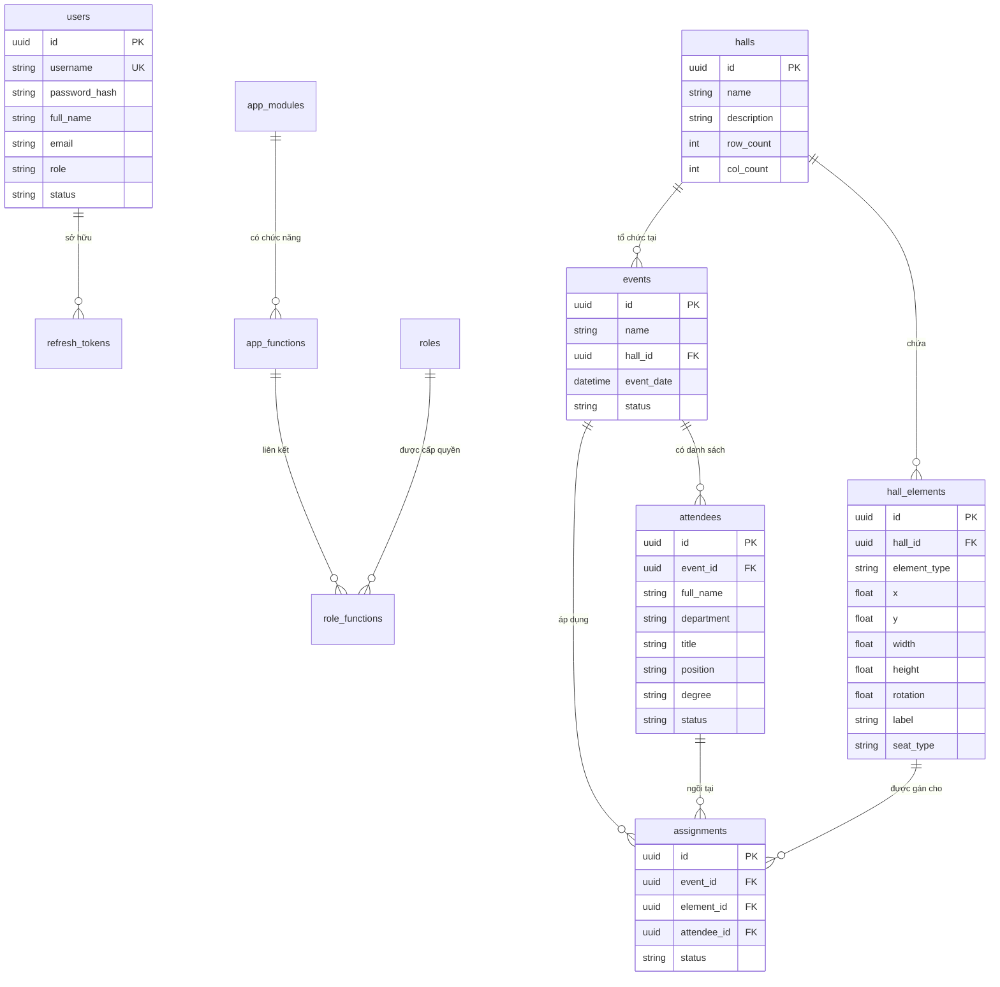

# TÀI LIỆU MÔ TẢ CHI TIẾT HỆ THỐNG QUẢN LÝ & THIẾT KẾ SƠ ĐỒ CHỖ NGỒI (SEATMAPDB / SEEDMAPS)

> **Phiên bản:** 1.0.0  
> **Ngày cập nhật:** 21/09/2026  
> **Trạng thái:** Dùng cho phát triển, vận hành và nghiệm thu  

---

## 1. TỔNG QUAN HỆ THỐNG

### 1.1. Giới thiệu dự án
**SeatMapDB / SEEDMAPS** là hệ thống phần mềm web chuyên nghiệp phục vụ công tác **thiết kế sơ đồ hội trường, quản lý danh sách đại biểu/khách mời, lập kế hoạch xếp chỗ ngồi và phục vụ trình chiếu/in ấn** cho các sự kiện, hội thảo, đại hội, chương trình nghệ thuật hoặc hội nghị cấp cao.

Hệ thống cho phép các đơn vị tổ chức dễ dàng dựng lại sơ đồ thực tế của hội trường bằng công cụ vẽ kéo-thả (Drag & Drop), phân loại khu vực/ghế ngồi, quản lý thông tin đại biểu chi tiết và thực hiện gán chỗ ngồi tự động hoặc thủ công một cách chính xác.

### 1.2. Mục tiêu hệ thống
* **Tối ưu hóa thời gian sắp xếp:** Thay thế việc xếp sơ đồ chỗ ngồi thủ công trên giấy/Excel bằng sơ đồ trực quan tương tác 2D.
* **Tự động hóa gán ghế:** Hỗ trợ thuật toán gán vị trí thông minh theo phòng ban, chức vụ, học hàm/học vị hoặc bảng chữ cái.
* **Đa dạng phần tử không gian:** Mô phỏng sinh động mọi vật thể trong hội trường (Ghế đại biểu, Ghế khách, Bàn làm việc, Sân khấu, Cửa ra vào, Vách ngăn, Khu vực).
* **Phục vụ đa kênh:** Hỗ trợ xem trực quan trên máy tính, trình chiếu màn hình LED/máy chiếu tại sự kiện (Presentation Mode) và xuất bản/in ấn sơ đồ nét cao kèm thẻ đại biểu.

---

## 2. CÔNG NGHỆ KỸ THUẬT (TECH STACK)

### 2.1. Frontend Stack
* **Core Library:** React 18 (TypeScript)
* **Build Tool:** Vite
* **Styling:** Tailwind CSS (Phối màu hiện đại, giao diện phẳng cao cấp, hỗ trợ responsive)
* **Icon System:** Lucide React Icons
* **State & Data Handling:** React State, Hooks, Custom Toast Notification System

### 2.2. Backend & Cơ sở dữ liệu (Multi-Database Support)
* **Cloud Database & Auth:** Supabase (PostgreSQL 15+)
* **SQL Server Database:** Microsoft SQL Server (T-SQL script tối ưu, xử lý toàn vẹn dữ liệu tránh lỗi lặp cascade)
* **Oracle Database:** Oracle SQL / PL-SQL

---

## 3. KIẾN TRÚC DỮ LIỆU & CƠ SỞ DỮ LIỆU (DATABASE ARCHITECTURE)

Hệ thống được thiết kế theo chuẩn CSDL quan hệ (Relational Database) chặt chẽ. Dưới đây là cấu trúc các bảng dữ liệu chính:



### 3.1. Chi tiết các bảng CSDL

#### 1. Bảng `users` (Tài khoản người dùng hệ thống)
* `id` (UUID, Primary Key): Định danh người dùng.
* `username` (NVARCHAR(100), Unique): Tên đăng nhập.
* `password_hash` (NVARCHAR(500)): Chuỗi mật khẩu đã mã hóa.
* `full_name` (NVARCHAR(255)): Họ và tên người dùng.
* `email` (NVARCHAR(255)): Email liên hệ.
* `role` (NVARCHAR(50)): Phân quyền (`admin`, `organizer`, `user`).
* `status` (NVARCHAR(50)): Trạng thái tài khoản (`active`, `locked`, `inactive`).

#### 2. Bảng `halls` (Hội trường / Sơ đồ khán phòng)
* `id` (UUID, Primary Key): Mã hội trường.
* `name` (NVARCHAR(255)): Tên hội trường (VD: "Hội trường A1", "Trung tâm Hội nghị Quốc gia").
* `description` (NVARCHAR(MAX)): Mô tả chi tiết.
* `row_count` (INT): Số lượng hàng trong lưới mặc định.
* `col_count` (INT): Số lượng cột trong lưới mặc định.

#### 3. Bảng `hall_elements` (Vật thể trong hội trường)
* `id` (UUID, Primary Key): Mã phần tử.
* `hall_id` (UUID, Foreign Key -> `halls.id`): Thuộc hội trường nào.
* `element_type` (NVARCHAR(50)): Loại vật thể (`chair` - Ghế, `table` - Bàn, `stage` - Sân khấu, `door` - Cửa/Lối đi, `wall` - Vách ngăn, `zone` - Khu vực).
* `x`, `y` (FLOAT): Tọa độ góc trên bên trái của vật thể trên canvas 2D.
* `width`, `height` (FLOAT): Kích thước rộng và cao của vật thể.
* `rotation` (FLOAT): Góc xoay (tính bằng độ: 0, 90, 180, 270,...).
* `label` (NVARCHAR(255)): Nhãn hiển thị (VD: "A-01", "Bàn Chủ tọa", "Sân khấu chính").
* `seat_type` (NVARCHAR(50)): Phân loại ghế (`delegate` - Đại biểu, `guest` - Khách mời, `empty` - Ghế trống).

#### 4. Bảng `events` (Sự kiện)
* `id` (UUID, Primary Key): Mã sự kiện.
* `name` (NVARCHAR(255)): Tên sự kiện (VD: "Đại hội Đổi mới Sáng tạo 2026").
* `hall_id` (UUID, Foreign Key -> `halls.id`): Địa điểm/Hội trường diễn ra.
* `event_date` (DATETIME2/TIMESTAMP): Thời gian tổ chức.
* `status` (NVARCHAR(50)): Trạng thái sự kiện (`planning` - Lên kế hoạch, `open` - Mở đăng ký, `assigned` - Đã gán vị trí, `completed` - Hoàn thành).

#### 5. Bảng `attendees` (Người tham dự / Đại biểu)
* `id` (UUID, Primary Key): Mã đại biểu.
* `event_id` (UUID, Foreign Key -> `events.id`): Thuộc sự kiện nào.
* `full_name` (NVARCHAR(255)): Họ và tên đại biểu.
* `department` (NVARCHAR(255)): Đơn vị / Phòng ban công tác.
* `title` (NVARCHAR(100)): Xưng danh (VD: "Ông", "Bà", "Đồng chí").
* `position` (NVARCHAR(200)): Chức vụ (VD: "Chủ tịch", "Trưởng phòng", "Chuyên viên").
* `degree` (NVARCHAR(100)): Học hàm/Học vị (VD: "GS.TS", "PGS.TS", "Thạc sĩ").
* `phone`, `email`, `notes`: Thông tin liên hệ và ghi chú thêm.
* `status` (NVARCHAR(50)): Trạng thái tham gia (`pending`, `assigned`, `absent`, `attended`).

#### 6. Bảng `assignments` (Gán đại biểu vào ghế)
* `id` (UUID, Primary Key): Mã bản ghi xếp chỗ.
* `event_id` (UUID, Foreign Key -> `events.id`): Sự kiện áp dụng.
* `element_id` (UUID, Foreign Key -> `hall_elements.id`): Mã vị trí ghế trong hội trường.
* `attendee_id` (UUID, Foreign Key -> `attendees.id`): Đại biểu được gán vào ghế.
* `status` (NVARCHAR(50)): Trạng thái (`assigned`, `cancelled`).
* **Ràng buộc:** 
  * Unique Constraint `(event_id, element_id)`: Một ghế chỉ xuất hiện 1 lần trong 1 sự kiện.
  * Unique Constraint `(event_id, attendee_id)`: Một đại biểu chỉ được ngồi 1 ghế trong 1 sự kiện.

#### 7. Bảng `app_modules` (Quản lý Module Hệ Thống)
* `id` (UUID, Primary Key): Mã module.
* `code` (NVARCHAR(50)): Mã định danh hệ thống (VD: `EVENT_MGT`).
* `name` (NVARCHAR(255)): Tên hiển thị module.
* `description` (NVARCHAR(MAX)): Mô tả về module.

#### 8. Bảng `app_functions` (Quản lý Chức năng)
* `id` (UUID, Primary Key): Mã chức năng.
* `module_id` (UUID, Foreign Key -> `app_modules.id`): Thuộc module nào.
* `code` (NVARCHAR(50)): Mã định danh chức năng (VD: `CREATE_EVENT`).
* `name` (NVARCHAR(255)): Tên thao tác (VD: "Thêm sự kiện").
* `description` (NVARCHAR(MAX)): Mô tả chức năng.

#### 9. Bảng `role_functions` (Mapping Phân quyền)
* `role_id` (UUID, Primary Key, Foreign Key -> `roles.id`): Role được gán quyền.
* `function_id` (UUID, Primary Key, Foreign Key -> `app_functions.id`): Chức năng được gán.

---

## 4. DANH SÁCH & CHI TIẾT CÁC CHỨC NĂNG HỆ THỐNG

Giao diện hệ thống bao gồm 8 phân hệ chính:

```
┌────────────────────────────────────────────────────────────────────────┐
│                        SEEDMAPS MAIN SYSTEM                            │
├───────────────┬────────────────────────────────────────────────────────┤
│ 1. Dashboard  │ Thống kê tổng quan, Chỉ số hoạt động, Lối tắt nhanh   │
│ 2. Halls      │ Quản lý Sơ đồ Hội trường, Kích thước lưới              │
│ 3. Designer   │ Trình Thiết kế Canvas tương tác Drag & Drop            │
│ 4. Events     │ Quản lý Danh sách Sự kiện & Lịch trình                │
│ 5. Attendees  │ Quản lý Danh sách Đại biểu, Import/Export Excel       │
│ 6. Assignment │ Gán Chỗ Ngồi Tương Tác & Gán Tự Động Thuật Toán        │
│ 7. Live View  │ Chế độ Trình Chiếu Màn Hình Lớn & Tra Cứu Trực Tiếp    │
│ 8. Print/PDF  │ Xuất Sơ Đồ Vector High-Res & In Thẻ/Biển Tên Bàn      │
│ 9. RBAC       │ Quản lý Hệ thống Phân quyền Động cho Module, Function │
└───────────────┴────────────────────────────────────────────────────────┘
```

---

### 4.1. Phân hệ 1: Bảng Điều Khiển Tổng Quan (Dashboard)
* **Thống kê KPI:**
  * Tổng số hội trường hiện có.
  * Tổng số sự kiện đang quản lý.
  * Tổng số đại biểu có trên hệ thống.
  * Tỷ lệ gán ghế trung bình (%) của các sự kiện active.
* **Lối tắt thao tác nhanh (Quick Actions):**
  * Tạo hội trường mới.
  * Mở trình thiết kế sơ đồ.
  * Thêm sự kiện mới.
  * Nhập danh sách đại biểu.
* **Danh sách sự kiện sắp diễn ra & Trạng thái hội trường:**
  * Hiển thị danh sách các sự kiện sắp diễn ra kèm thời gian, địa điểm hội trường và tỷ lệ xếp chỗ.

---

### 4.2. Phân hệ 2: Quản Lý Hội Trường (Halls Management)
* **Danh sách hội trường:** Hiển thị thẻ thông tin dạng Grid/List gồm tên hội trường, mô tả, kích thước lưới (hàng x cột), tổng số phần tử/ghế.
* **Tạo/Sửa/Xóa hội trường:**
  * Nhập Tên hội trường, Mô tả chi tiết.
  * Thiết lập Kích thước lưới sơ đồ cơ sở (Row Count x Col Count).
* **Mở Trình thiết kế (Seat Designer):** Nút chuyển nhanh sang giao diện thiết kế Canvas cho hội trường chọn trước.

---

### 4.3. Phân hệ 3: Trình Thiết Kế Sơ Đồ Chỗ Ngồi (Seat Designer Page)
Đây là phân hệ cốt lõi cung cấp môi trường Canvas trực quan tương tác 2D:

* **Thanh công cụ vẽ (Toolbox):**
  * `Select`: Chế độ chọn và di chuyển vật thể.
  * `Ghế Đại biểu (Chair)`: Tạo ghế đại biểu (Delegate).
  * `Bàn (Table)`: Tạo bàn làm việc / bàn hội nghị.
  * `Sân khấu (Stage)`: Tạo khu vực sân khấu trung tâm.
  * `Cửa / Lối đi (Door)`: Định vị các vị trí cửa ra vào.
  * `Vách ngăn (Wall)`: Tạo tường hoặc vách ngăn không gian.
  * `Khu vực (Zone)`: Khoanh vùng khu vực (VIP, Khách mời, Kỹ thuật...).
* **Tính năng thao tác trên Canvas:**
  * **Drag & Drop (Kéo - Thả):** Di chuyển linh hoạt vật thể trên lưới.
  * **Snap to Grid (Bắt điểm vào lưới):** Giúp căn thẳng hàng thẳng cột dễ dàng.
  * **Rotate (Xoay góc):** Xoay vật thể theo góc 90 độ hoặc độ tự do.
  * **Resize (Đổi kích thước):** Kéo thay đổi chiều rộng (`width`) và chiều cao (`height`).
  * **Auto-Numbering (Tự động đánh số ghế):** Chọn dải ghế và sinh số tự động theo quy tắc (A-01, A-02,... hoặc 101, 102,...).
  * **Duplicate (Sao chép hàng loạt):** Nhân bản ghế/bàn đã tạo để dựng nhanh sơ đồ lớn.
  * **Align (Căn chỉnh vị trí):** Căn lề trái, phải, giữa, trên, dưới cho nhóm phần tử đã chọn.
  * **Undo/Redo:** Lịch sử thao tác giúp khôi phục dễ dàng khi vẽ sai.

---

### 4.4. Phân hệ 4: Quản Lý Sự Kiện (Events Management)
* **Danh sách sự kiện:** Quản lý tập trung toàn bộ các sự kiện tổ chức.
* **Tạo & Cấu hình sự kiện:**
  * Tên sự kiện, Mô tả nội dung.
  * Chọn Hội trường tổ chức (Liên kết với dữ liệu trong Phân hệ Halls).
  * Ngày giờ diễn ra sự kiện.
  * Thiết lập Trạng thái sự kiện: Lên kế hoạch (`planning`), Mở đăng ký (`open`), Đã xếp chỗ (`assigned`), Hoàn thành (`completed`).
* **Bộ lọc & Tìm kiếm:** Lọc sự kiện theo khoảng thời gian, trạng thái và từ khóa.

---

### 4.5. Phân hệ 5: Quản Lý Người Tham Dự (Attendees Management)
* **Hồ sơ đại biểu chi tiết:**
  * Họ và tên đại biểu.
  * Xưng danh (Ông, Bà, Đồng chí,...).
  * Học hàm / Học vị (GS.TS, PGS.TS, TS, ThS,...).
  * Chức vụ (Chủ tịch, Giám đốc, Trưởng phòng,...).
  * Đơn vị / Phòng ban công tác.
  * Điện thoại, Email, Ghi chú đặc biệt.
* **Import/Export Dữ liệu:**
  * **Import Excel/CSV:** Nhập nhanh hàng trăm đại biểu từ file danh sách có sẵn.
  * **Export Excel/CSV:** Xuất danh sách ra file phục vụ lưu trữ.
* **Phân loại & Trạng thái:** Lọc danh sách theo Phòng ban, Sự kiện, Trạng thái gán chỗ (Đã có ghế / Chưa có ghế / Vắng mặt).

---

### 4.6. Phân hệ 6: Gán Chỗ Ngồi Tương Tác (Seat Assignment Page)
Phân hệ liên kết danh sách đại biểu vào sơ đồ chỗ ngồi thực tế:

* **Màn hình giao diện kép:**
  * **Bên trái:** Danh sách đại biểu chưa xếp chỗ (có thanh tìm kiếm, lọc phòng ban).
  * **Bên phải:** Sơ đồ trực quan 2D của hội trường với mã màu trạng thái ghế (Đã gán ghế / Ghế còn trống / Ghế khách).
* **Phương thức gán chỗ:**
  * **Kéo - Thả (Drag & Drop):** Kéo đại biểu từ danh sách bên trái thả trực tiếp vào vị trí ghế trên sơ đồ.
  * **Gán thủ công (Click to Assign):** Chọn đại biểu -> Chọn ghế mong muốn.
  * **Hủy gán ghế:** Click vào ghế đã có người và nhấn "Hủy gán".
* **Thuật toán Gán Chỗ Tự Động (Auto-Assign Algorithm):**
  1. *Gán theo Bảng chữ cái (A-Z)*.
  2. *Gán nhóm theo Phòng ban / Đơn vị* (Đảm bảo đại biểu cùng đơn vị ngồi gần nhau).
  3. *Gán theo Cấp bậc / Chức vụ* (Đại biểu cao cấp ngồi các hàng ghế đầu / vị trí VIP).

---

### 4.7. Phân hệ 7: Chế Độ Trình Chiếu & Tra Cứu Trực Tiếp (Presentation / Live View)
Phục vụ màn hình LED hội trường hoặc bàn đón tiếp check-in đại biểu:

* **Full-screen Presentation:** Giao diện tối ưu full màn hình không chứa các công cụ quản trị.
* **Tra cứu đại biểu tức thì:** Nhập tên đại biểu hoặc phòng ban để hệ thống highlight (làm nổi bật) vị trí ghế ngồi tương ứng trên màn hình sơ đồ.
* **Zoom & Pan:** Phóng to / Thu nhỏ / Di chuyển góc nhìn giúp đại biểu quan sát vị trí ngồi từ xa.

---

### 4.8. Phân hệ 8: Xuất Bản Báo Cáo & In Ấn (Print & Export Page)
* **In Sơ đồ Chỗ ngồi (Seating Map Print):** Xuất sơ đồ hội trường dạng chuẩn Vector high-res để in ấn bản khổ lớn (A0, A1, A3, A4).
* **Xuất Báo cáo danh sách xếp chỗ:** Xuất file chi tiết vị trí ngồi của từng đại biểu xếp theo thứ tự hàng/ghế hoặc theo bảng chữ cái.
* **In Thẻ Đại Biểu & Biển Tên Để Bàn (Table Tents / Name Cards):** Tự động dàn trang in biển tên để bàn kèm thông tin Họ tên, Chức vụ, Đơn vị và Số ghế ngồi chính xác.

---

### 4.9. Phân hệ 9: Phân quyền hệ thống (RBAC - Role-Based Access Control)
* **Quản lý danh sách Modules & Functions:** Ghi nhận toàn bộ tính năng và module đang có của hệ thống (VD: Module Hội trường, Chức năng Thêm/Sửa/Xóa hội trường).
* **Quản lý Role & Phân quyền động:** 
  * Cho phép Admin gán hoặc gỡ quyền truy cập từng chức năng nhỏ (Function) cho từng Role khác nhau thông qua giao diện Checkbox trực quan.
  * Việc phân quyền được kiểm tra chặt chẽ ở cả Frontend (ẩn/hiện UI/nút bấm) và Backend (chặn truy cập API trái phép).

---

## 5. YÊU CẦU PHI CHỨC NĂNG & BẢO MẬT

### 5.1. Trải nghiệm người dùng (UX/UI)
* Giao diện hiện đại, áp dụng nguyên tắc thiết kế phẳng, màu sắc phân quầng hài hòa.
* Tốc độ phản hồi cực nhanh trên Canvas nhờ tối ưu hóa React Render & DOM State.
* Tương thích tốt trên cả máy tính bàn (Desktop) và máy tính bảng (Tablet).

### 5.2. Hiệu năng & Khả năng mở rộng
* Xử lý mượt mà sơ đồ hội trường quy mô lớn với trên **1.000 phần tử/ghế** cùng lúc.
* Khả năng chịu tải đồng thời nhiều phiên tra cứu vị trí đại biểu tại sự kiện.

### 5.3. An toàn & Bảo mật dữ liệu
* Mã hóa mật khẩu tài khoản người dùng.
* Cơ chế xác thực phiên làm việc qua JWT Refresh Token bảo mật.
* Phân quyền truy cập theo vai trò: Admin (Toàn quyền), Organizer (Quản lý sự kiện), User (Chỉ xem/tra cứu).

---

## 6. HƯỚNG DẪN CÀI ĐẶT & VẬN HÀNH

### 6.1. Yêu cầu môi trường
* Node.js phiên bản **18.x** trở lên.
* Trình duyệt web hiện đại (Google Chrome, Microsoft Edge, Firefox, Safari).

### 6.2. Các bước khởi chạy dự án

1. **Cài đặt thư viện phụ thuộc:**
   ```bash
   cd project
   npm install
   ```

2. **Cấu hình môi trường (`.env`):**
   Tạo file `.env` tại thư mục root dự án và khai báo thông tin Supabase (nếu dùng cloud):
   ```env
   VITE_SUPABASE_URL=https://your-supabase-project.supabase.co
   VITE_SUPABASE_ANON_KEY=your-anon-key
   ```

3. **Khởi tạo Database (SQL Server / Oracle):**
   * Đối với SQL Server: Thực thi file script `database_sqlserver.sql`.
   * Đối với Oracle DB: Thực thi file script `database_oracle.sql`.

4. **Chạy ứng dụng chế độ Development:**
   ```bash
   npm run dev
   ```
   Ứng dụng sẽ chạy tại địa chỉ: `http://localhost:5173`.

5. **Build đóng gói ứng dụng Production:**
   ```bash
   npm run build
   ```

---

## 7. KẾT LUẬN

Hệ thống **SeatMapDB / SEEDMAPS** cung cấp giải pháp toàn diện và chuyên nghiệp cho bài toán sắp xếp sơ đồ hội trường và quản lý đại biểu. Với thiết kế mở, mã nguồn chuẩn hóa bằng TypeScript/React và mô hình dữ liệu linh hoạt, hệ thống dễ dàng mở rộng và tích hợp thêm các tính năng nâng cao trong tương lai (như quét mã QR check-in đại biểu, tự động gợi ý vị trí theo AI).
